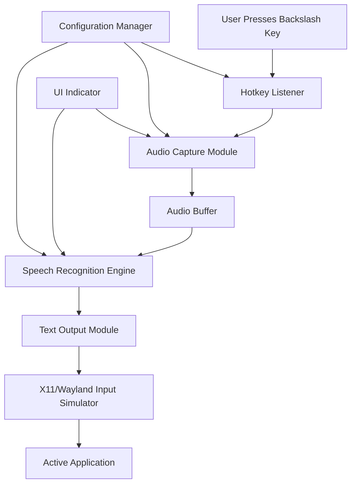

# Zephyr Design Document

## Overview

Zephyr is a lightweight voice-to-text application for Omarchy Linux that uses push-to-talk activation via the backslash key. The application runs as a background daemon, listens for the global hotkey, captures audio when activated, transcribes speech using OpenAI's Whisper model, and simulates keyboard input to type the transcribed text into the active application.

The architecture prioritizes low resource usage when idle, fast activation, and high transcription accuracy across multiple accents and languages.

## Architecture

### System Architecture Diagram



### Technology Stack

- **Language**: Python 3.11+
- **Speech Recognition**: OpenAI Whisper (whisper.cpp for performance)
- **Audio Capture**: PyAudio or sounddevice
- **Hotkey Management**: pynput or python-xlib
- **Input Simulation**: python-xlib (X11) or python-evdev (Wayland)
- **UI Indicator**: GTK4 or Qt6 (minimal overlay)
- **Configuration**: YAML or TOML format
- **Packaging**: Standard Python setuptools with AUR PKGBUILD

### Component Architecture

The application follows a modular architecture with clear separation of concerns:

1. **Daemon Process**: Main background service that coordinates all components
2. **Hotkey Listener**: Monitors keyboard events for activation key
3. **Audio Capture**: Records microphone input during PTT
4. **Speech Recognition**: Transcribes audio to text using Whisper
5. **Input Simulator**: Types transcribed text into active window
6. **UI Overlay**: Provides visual feedback during operation
7. **Configuration Manager**: Handles user settings and preferences

## Components and Interfaces

### 1. Daemon Process (`zephyr_daemon.py`)

**Responsibilities:**
- Initialize all subsystems on startup
- Coordinate communication between components
- Handle graceful shutdown and cleanup
- Manage application lifecycle

**Interface:**
```python
class ZephyrDaemon:
    def __init__(self, config_path: str)
    def start(self) -> None
    def stop(self) -> None
    def reload_config(self) -> None
```

### 2. Hotkey Listener (`hotkey_listener.py`)

**Responsibilities:**
- Register global hotkey (default: backslash)
- Detect key press and release events
- Filter out accidental short presses (<100ms)
- Emit events to audio capture module

**Interface:**
```python
class HotkeyListener:
    def __init__(self, hotkey: str, callback: Callable)
    def start(self) -> None
    def stop(self) -> None
    def set_hotkey(self, hotkey: str) -> None
    
    # Callbacks
    def on_key_press(self) -> None
    def on_key_release(self) -> None
```

**Implementation Notes:**
- Use `pynput` for cross-platform hotkey support
- Implement debouncing to prevent accidental activation
- Run in separate thread to avoid blocking main process

### 3. Audio Capture Module (`audio_capture.py`)

**Responsibilities:**
- Initialize audio input device
- Record audio while PTT key is held
- Buffer audio data in memory
- Save audio to temporary file for processing
- Release audio device when not in use

**Interface:**
```python
class AudioCapture:
    def __init__(self, sample_rate: int = 16000, channels: int = 1)
    def start_recording(self) -> None
    def stop_recording(self) -> bytes
    def get_audio_level(self) -> float
    def release_device(self) -> None
```

**Implementation Notes:**
- Use 16kHz sample rate (optimal for Whisper)
- Mono channel recording to reduce file size
- Apply noise reduction using `noisereduce` library
- Implement circular buffer to prevent memory overflow on long recordings

### 4. Speech Recognition Engine (`speech_recognition.py`)

**Responsibilities:**
- Load Whisper model (default: base or small model)
- Perform streaming transcription with real-time updates
- Handle multiple languages and accents
- Provide confidence scores for transcription
- Cache model in memory for fast subsequent transcriptions
- Support incremental transcription updates as user speaks

**Interface:**
```python
class SpeechRecognizer:
    def __init__(self, model_name: str = "base", language: str = "en")
    def start_streaming_transcription(self, callback: Callable[[str], None]) -> None
    def process_audio_chunk(self, audio_chunk: bytes) -> None
    def finalize_transcription(self) -> TranscriptionResult
    def set_language(self, language: str) -> None
    def unload_model(self) -> None

class TranscriptionResult:
    text: str
    confidence: float
    language: str
    segments: List[Segment]
    is_final: bool
```

**Implementation Notes:**
- Use `faster-whisper` for streaming transcription support
- Process audio in 1-second chunks for real-time feedback
- Emit partial transcription results via callback
- Use Voice Activity Detection (VAD) to detect speech segments
- Implement sliding window approach for continuous transcription
- Allow transcription updates to replace previous text
- Support model selection: tiny, base, small, medium (large for high-end systems)
- Implement model caching to avoid reload on each transcription
- Use `language="auto"` for automatic language detection
- Buffer last 2 seconds of audio for context when updating transcription

### 5. Input Simulator (`input_simulator.py`)

**Responsibilities:**
- Detect currently focused window and input field
- Simulate keyboard typing of transcribed text with real-time updates
- Handle text replacement when user changes their mind
- Handle special characters and Unicode
- Preserve cursor position and selection state

**Interface:**
```python
class InputSimulator:
    def __init__(self, typing_speed: int = 50)
    def start_streaming_input(self) -> None
    def update_text(self, new_text: str) -> bool  # Replace previous text
    def append_text(self, text: str) -> bool  # Add to existing text
    def finalize_input(self) -> None
    def get_focused_window(self) -> Optional[str]
    def is_input_field_focused(self) -> bool
```

**Implementation Notes:**
- Use `python-xlib` for X11 systems
- Use `python-evdev` with uinput for Wayland systems
- Track the number of characters typed to enable replacement
- When transcription updates, delete previous characters and type new text
- Use backspace simulation to remove old text before typing updates
- Implement character-by-character typing with configurable delay
- Handle clipboard as fallback if direct typing fails
- Escape special characters that might trigger shortcuts
- Maintain internal state of typed text for accurate replacement

### 6. UI Overlay (`ui_overlay.py`)

**Responsibilities:**
- Display single rounded rectangle overlay only when backslash key is pressed
- Show real-time audio level visualization with animated waveform
- Display live transcription text as user speaks
- Update displayed text when user changes their mind mid-sentence
- Auto-hide with fade-out animation after completion
- Center overlay on screen with smooth fade-in animation

**Interface:**
```python
class UIOverlay:
    def __init__(self)
    def show_recording(self) -> None  # Fade in overlay
    def update_audio_level(self, level: float) -> None  # Animate waveform
    def update_transcription(self, text: str, is_final: bool) -> None  # Show live text
    def hide(self) -> None  # Fade out overlay
    def show_error(self, message: str) -> None
```

**Visual Design:**
- Single rounded rectangle (border-radius: 16px)
- Semi-transparent background with blur effect
- Centered on screen
- Top section: Animated waveform visualization (40px height)
- Bottom section: Live transcription text with smooth updates
- Smooth fade-in (200ms) on key press
- Smooth fade-out (300ms) after completion
- Text updates with subtle fade transition
- Size: 400px width, dynamic height (120-300px based on text length)

**Animation States:**
1. **Hidden**: Completely invisible, no window shown
2. **Recording**: Fade in + animated waveform bars responding to audio level
3. **Transcribing**: Waveform continues + live text appears below with typing effect
4. **Updating**: Text smoothly transitions when user changes their mind
5. **Complete**: Brief checkmark animation, then fade out

**Implementation Notes:**
- Use GTK4 with CSS for rounded corners and blur
- Implement custom Cairo drawing for waveform animation
- Use GLib timeout for smooth 60fps animations
- Display transcription text with monospace font for clarity
- Highlight text changes with subtle color transition
- Show partial transcription in lighter color, final text in full opacity
- Keep overlay always-on-top with no window decorations
- Position at screen center using monitor geometry
- Only create window when key is pressed (lazy initialization)
- Destroy window after fade-out to minimize resource usage
- Auto-expand height when text wraps to multiple lines

### 7. Configuration Manager (`config_manager.py`)

**Responsibilities:**
- Load configuration from file
- Provide default values for missing settings
- Validate configuration values
- Watch for configuration file changes
- Emit events on configuration updates

**Interface:**
```python
class ConfigManager:
    def __init__(self, config_path: str)
    def load(self) -> Config
    def save(self, config: Config) -> None
    def watch_for_changes(self, callback: Callable) -> None
    
class Config:
    hotkey: str
    model_name: str
    language: str
    sample_rate: int
    typing_speed: int
    minimal_ui: bool
    min_press_duration: int
    auto_start: bool
```

**Configuration File Format (YAML):**
```yaml
# ~/.config/zephyr/config.yaml
hotkey: "backslash"
model: "base"
language: "auto"
audio:
  sample_rate: 16000
  channels: 1
typing:
  speed: 50  # characters per second
  use_clipboard_fallback: true
ui:
  width: 400
  height: 120
  border_radius: 16
  background_opacity: 0.95
  blur_enabled: true
  animation_speed: 1.0  # multiplier for animation timing
advanced:
  min_press_duration: 100  # milliseconds
  auto_start: true
  log_level: "INFO"
```

## Data Models

### Audio Data Flow

```
Microphone → PyAudio → Raw PCM Buffer (1s chunks) → Noise Reduction → Streaming Whisper → Live Text Updates → Input Field
                                                                              ↓
                                                                         UI Overlay Display
```

**Streaming Pipeline:**
1. Audio captured in 1-second chunks
2. Each chunk processed through VAD (Voice Activity Detection)
3. Active speech chunks sent to Whisper for transcription
4. Partial results emitted every 1-2 seconds
5. UI overlay shows live transcription
6. Input simulator types text in real-time
7. When transcription updates, old text is replaced with new text

### Audio Buffer Structure

```python
@dataclass
class AudioBuffer:
    sample_rate: int
    channels: int
    data: bytes
    duration: float
    timestamp: datetime
```

### Transcription Result

```python
@dataclass
class TranscriptionResult:
    text: str
    confidence: float
    language: str
    duration: float
    segments: List[TranscriptionSegment]

@dataclass
class TranscriptionSegment:
    text: str
    start: float
    end: float
    confidence: float
```

## Error Handling

### Error Categories

1. **Audio Device Errors**
   - No microphone detected
   - Microphone access denied
   - Audio device busy

2. **Transcription Errors**
   - Model loading failure
   - Insufficient audio data
   - Transcription timeout

3. **Input Simulation Errors**
   - No focused window
   - Input field not detected
   - Permission denied for input simulation

4. **Configuration Errors**
   - Invalid configuration file
   - Missing required settings
   - Invalid hotkey specification

### Error Handling Strategy

```python
class ZephyrError(Exception):
    """Base exception for Zephyr errors"""
    pass

class AudioDeviceError(ZephyrError):
    """Raised when audio device is unavailable"""
    pass

class TranscriptionError(ZephyrError):
    """Raised when transcription fails"""
    pass

class InputSimulationError(ZephyrError):
    """Raised when text input fails"""
    pass
```

**Error Recovery:**
- Display user-friendly notifications for all errors
- Log detailed error information for debugging
- Attempt automatic recovery for transient errors
- Gracefully degrade functionality when possible
- Provide clear instructions for user action when needed

## Testing Strategy

### Unit Tests

- Test each component in isolation
- Mock external dependencies (audio devices, Whisper model)
- Verify configuration loading and validation
- Test error handling paths

### Integration Tests

- Test hotkey detection and audio capture flow
- Test audio capture to transcription pipeline
- Test transcription to input simulation flow
- Verify configuration changes are applied correctly

### System Tests

- Test complete end-to-end workflow
- Verify multi-accent support with sample audio files
- Test resource usage under various conditions
- Verify AUR package installation and removal

### Performance Tests

- Measure idle resource usage (CPU, RAM)
- Measure transcription latency for various audio lengths
- Test with different Whisper model sizes
- Verify typing speed accuracy

### Test Audio Samples

Include test audio files with various accents:
- American English
- British English
- Australian English
- Indian English
- Non-native English speakers
- Background noise scenarios

## Deployment and Packaging

### AUR Package Structure

```
zephyr/
├── PKGBUILD
├── zephyr.install
├── zephyr.service (systemd user service)
└── zephyr.desktop (autostart entry)
```

### PKGBUILD Requirements

```bash
# Dependencies
depends=('python' 'python-pip' 'portaudio' 'gtk4')
makedepends=('python-setuptools' 'python-build' 'python-installer' 'python-wheel')
optdepends=(
    'whisper.cpp: Faster transcription performance'
    'python-noisereduce: Improved audio quality'
)
```

### Installation Locations

- Binary: `/usr/bin/zephyr`
- System config: `/etc/zephyr/config.yaml`
- User config: `~/.config/zephyr/config.yaml`
- Models cache: `~/.cache/zephyr/models/`
- Logs: `~/.local/share/zephyr/logs/`

### Systemd Integration

Create user service for auto-start:
```ini
[Unit]
Description=Zephyr Voice Input Service
After=graphical-session.target

[Service]
Type=simple
ExecStart=/usr/bin/zephyr --daemon
Restart=on-failure

[Install]
WantedBy=default.target
```

## Security Considerations

1. **Microphone Access**: Request permission on first run
2. **Input Simulation**: Requires X11 or uinput permissions
3. **Model Downloads**: Verify checksums for Whisper models
4. **Configuration**: Validate all user inputs to prevent injection
5. **Logging**: Avoid logging sensitive transcribed content

## Performance Optimization

1. **Model Selection**: Default to "base" model for balance of speed and accuracy
2. **Lazy Loading**: Load Whisper model only on first use
3. **Model Caching**: Keep model in memory between transcriptions
4. **Audio Buffering**: Use efficient circular buffer for recording
5. **Threading**: Run audio capture and transcription in separate threads
6. **Resource Cleanup**: Release audio device immediately after recording

## Future Enhancements

- Support for custom wake words
- Integration with text editors for code dictation
- Command mode for voice-controlled actions
- Cloud-based transcription option for better accuracy
- Multi-language mixing in single transcription
- Punctuation and formatting voice commands
